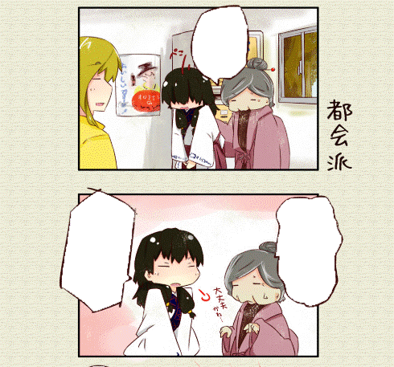

# mo-code-4koma
道草屋バックヤード漫画の配信用

### 透過画像を重ねる

[みちくさびゅあー](https://iranika.github.io/mo-code/)は多言語対応を目的として、画像の重ね表示(overlay)に対応しました。  
これにより、ビュアーで元画像の上に翻訳版の透過画像(gif)を重ねて表示することできるようになりました。  
次の画像は元画像に白吹き出しを重ねて表示した例です。  

現在は英語および中文繁体字の翻訳を対象にしていますが、他にも面白い利用ができるかもしれません。  
(関西弁やおもしろ吹き出し等)
もし何かをビュアーで表示させたい場合は、issueもしくはいらにか([@happy_packet](https://twitter.com/happy_packet))までご連絡ください。

### 翻訳作業への参加:WIP

翻訳作業に協力していただけるボランティアを募集しています。
漫画の翻訳作業に貢献するための手順をご紹介します。

#### はじめに:WIP

翻訳されたデータをこのリポジトリにアップすることで、リリースされます。

1. 画像のダウンロード

1. 画像の加工

1. 画像のアップロード

#### 翻訳時の推奨ルール:WIP

1. 貴方が何かしらの理由でこの推奨ルールを破るとき、私はそれを非難しません。  
このルールはクオリティマネジメントのためにありますが、ルールを守ることで貴方の生み出すクオリティが下がるのであれば、ルールを破って構いません。  
ただ、特に理由がなければ貴方は推奨ルールを守るべきです。  
統一されたルールは安定したクオリティを生み出すために効果的です。

1. Englishのフォントは〇〇を推奨します。Chineseのフォントは〇〇を推奨します。
